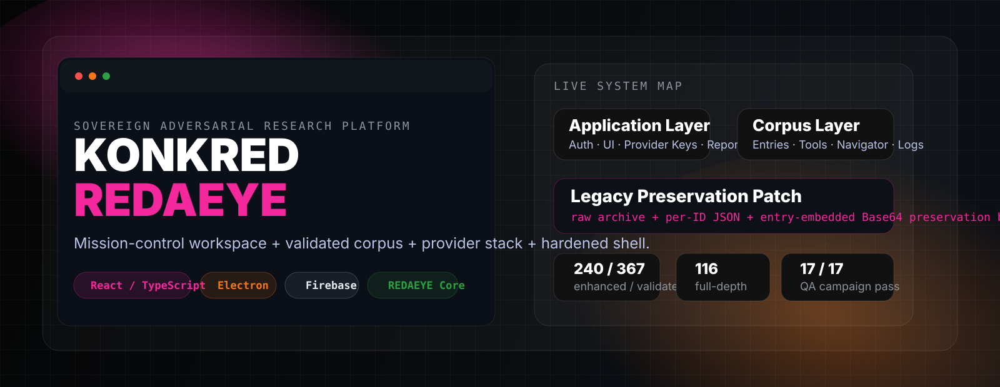
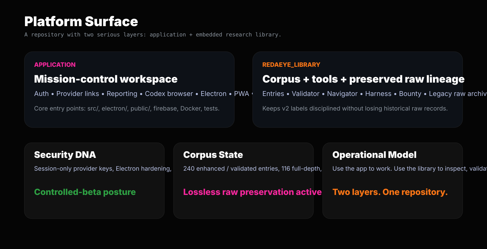

<p align="center">
  
</p>

<p align="center">
  <a href="./README_EXPERIENCE.html"></a>
  
  
  
  
</p>

# KONKRED REDAEYE

**KONKRED REDAEYE** is a mission-control style adversarial research workspace built with React, TypeScript, Firebase, and Electron — with an embedded **REDAEYE library bundle** that carries the corpus, navigator, validator tooling, harness assets, and lossless legacy preservation archive inside the same repository.

This is **not** just an app and **not** just a corpus dump.
It is a two-layer system:

| Layer | Role |
|---|---|
| **Application Platform** | authenticated workspace for provider connectivity, reporting, codex navigation, and operator workflows |
| **REDAEYE Library** | structured corpus export containing entries, tools, navigator, docs, harness material, bounty artifacts, and preserved raw legacy lineage |

---

## Open the richer experience

| View | Purpose |
|---|---|
| [`README_EXPERIENCE.html`](./README_EXPERIENCE.html) | Stylized repository presentation that visually matches the product’s dark mission-control aesthetic more closely than GitHub Markdown can |
| [`REDAEYE_LIBRARY/index.html`](./REDAEYE_LIBRARY/index.html) | Landing page into the copied corpus/library layer |
| [`REDAEYE_LIBRARY/navigator/index.html`](./REDAEYE_LIBRARY/navigator/index.html) | Offline navigator for the REDAEYE corpus |

> GitHub README rendering is intentionally restricted: no script runtime, limited HTML/CSS. That is why this repo includes a companion **README experience page** in addition to this Markdown readme.

---

## Visual map

<p align="center">
  
</p>

---

## What lives in this repository

### 1) Root application surface
| Path | Function |
|---|---|
| `src/` | Main React/TypeScript workspace application |
| `electron/` | Hardened desktop shell |
| `public/` | PWA/static assets |
| `tests/` | Smoke and e2e testing |
| `firebase.json`, Firestore rules/indexes | Auth + data boundary config |
| `Dockerfile`, `nginx.conf` | Containerized web deployment path |

### 2) Embedded REDAEYE library surface
| Path | Function |
|---|---|
| `REDAEYE_LIBRARY/entries/` | corpus entries |
| `REDAEYE_LIBRARY/tools/` | validator, builders, preservation utilities |
| `REDAEYE_LIBRARY/harness/` | assessment harness + QA campaign |
| `REDAEYE_LIBRARY/bounty/` | bounty platform artifacts |
| `REDAEYE_LIBRARY/navigator/` | offline interactive navigator |
| `REDAEYE_LIBRARY/core/` | models registry, references, queue, triage, spec |
| `REDAEYE_LIBRARY/docs/` | progress + queue + validation history |
| `REDAEYE_LIBRARY/legacy_preservation/` | raw source preservation archive |

---

## Application architecture

### Authentication and shell
The app restores Firebase-authenticated sessions and routes authenticated users into a dashboard composed of lazy-loaded research workspaces.

### Provider connectivity
The provider layer uses normalized transport primitives with:

| Capability | Status |
|---|---|
| timeout enforcement | yes |
| retry policy for transient failures | yes |
| caller cancellation preservation | yes |
| schema validation with Zod | yes |
| normalized model listing | yes |
| normalized chat completion transport | yes |

Key files:
- `src/services/httpClient.ts`
- `src/services/providerClient.ts`
- `src/services/providerSchemas.ts`

### Workspace modules
The dashboard lazy-loads multiple modules, including:

- Prime workspace
- Fusion / exploitation / deep-scan surfaces
- library / codex browsing
- reporting / PDF export
- sync / settings / profile
- CLI-style and telemetry surfaces
- key/provider management

---

## Security posture

| Control | Present |
|---|---:|
| Firebase Auth gate | ✅ |
| Session-only provider keys in renderer flow | ✅ |
| Response schema validation | ✅ |
| Request timeout + retry discipline | ✅ |
| Electron context isolation | ✅ |
| Electron node integration disabled | ✅ |
| Electron sandboxing | ✅ |
| SVG sanitization before DOM insertion | ✅ |
| CSP / production header hardening | ✅ |
| Private vulnerability reporting policy | ✅ |

### Important operational truth
This project has a **strong local security posture for an internal-alpha / controlled-beta system**, but it is **not yet a complete backend-vault architecture**. For high-sensitivity or regulated use, provider credentials and policy-critical operations should move behind a server-side trust boundary.

---

## REDAEYE library state

| Metric | Value |
|---|---:|
| Total legacy-origin corpus cards | 367 |
| Enhanced / validated entries | 240 |
| Full-depth entries | 116 |
| Compact entries | 124 |
| Remaining legacy-only cards | 127 |
| Validator failures | 0 |
| QA campaign | 17 / 17 pass |

### Preservation model
This repository preserves the original legacy record **without letting legacy noise silently rewrite the validated v2 layer**.

| Preservation layer | Meaning |
|---|---|
| `legacy_preservation/by_id/` | raw per-entry legacy JSON archive |
| `legacy_raw_all_367_by_id.json` | full archive in one file |
| `LEGACY_RAW_PRESERVATION_BLOCK` inside enhanced entries | recoverable embedded raw legacy payload for traceability |

That means the repository can simultaneously provide:
- a safer, evidence-labeled v2 interpretation
- the original raw legacy source record
- reproducible validation status

---

## Local development

```bash
npm ci
npm run dev
```

### Quality gates
```bash
npm run lint
npm run format:check
npm test -- --run
npm run build
npm audit --audit-level=moderate
```

### Production web build
```bash
npm run build
npm run preview
```

### Electron build
```bash
npm run electron:build
```

### Android build
```bash
npm run android:add
npm run android:build
```

### Docker
```bash
npm run docker:build
docker run --rm -p 8080:8080 konkred-redaeye:local
```

### Firebase deploy
```bash
firebase emulators:start
npm run build
npm run firebase:deploy
```

---

## How to use this repository by intent

| If you want to... | Start here |
|---|---|
| run the app | `npm ci && npm run dev` |
| inspect the corpus visually | `REDAEYE_LIBRARY/index.html` |
| browse the offline navigator | `REDAEYE_LIBRARY/navigator/index.html` |
| validate the corpus export | `cd REDAEYE_LIBRARY && python3 tools/validate_entries.py` |
| inspect preserved raw legacy lineage | `REDAEYE_LIBRARY/legacy_preservation/manifest.json` |
| review trust boundaries | `SECURITY.md` + service layer |

---

## What this repository is good at

| Strength | Why it matters |
|---|---|
| structured operator workspace | the app is already cohesive enough to use as a serious internal research surface |
| transport discipline | provider transport is normalized and schema-validated |
| embedded corpus operations | the library is not external or hand-waved; it ships inside the repo |
| traceable preservation | legacy records are recoverable rather than silently rewritten away |
| reproducible QA posture | validator + QA campaign + navigator build are part of the working state |

---

## What is still unfinished

| Gap | Reality |
|---|---|
| backend vault boundary | still needed for production-grade secret handling |
| final production trust separation | still stronger in local shell than in a hardened backend architecture |
| corpus completion | 240/367 enhanced means the program is deep into execution, not complete |
| release polish | exists, but can still be tightened around packaging, docs, and deployment ergonomics |

---

## Responsible security reporting

Use `SECURITY.md` for vulnerability reporting.

Do **not** open public issues containing:
- provider API keys
- OAuth tokens
- Firebase credentials
- private prompts
- user data
- live third-party exploit data

Minimum report shape:
- affected version / commit
- reproduction steps
- impact assessment
- minimal proof without real credentials or third-party data

---

## Bottom line

**KONKRED REDAEYE** is already beyond toy stage.
It is a serious, dark-surfaced, operator-facing research workspace with a bundled corpus pipeline, a real QA posture, and a preservation model that keeps the old world visible while forcing the new one to stay disciplined.
